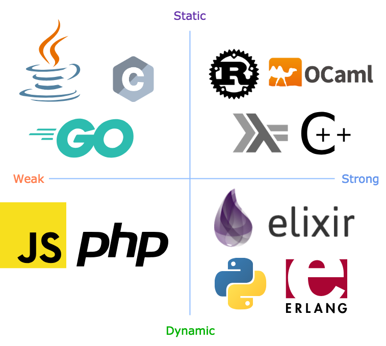

class: middle, center

# Gradualizer - a gradual type system for Erlang

Radek Szymczyszyn
<br/>
@erszcz

---

## Typing disciplines

A (hopefully not too controversial) type system classification
based on my selective knowledge and anecdotal evidence:

.center[ .scale450x450[] ]

<!--

The above image is a prettier equivalent of the following diagram:

```
            static
              |
      C  Go   |  Haskell OCaml
       Java   |  C++ Rust
              |
weak ---------+--------- strong
              |
   JavaScript |  Python
          PHP |  Erlang Elixir
              |
           dynamic
```

-->

???

- two axes characterising PLs wrt typing
- some confusion
- spark a discussion
- "why did you put C on the left but C++ on the right given they have
   at least as many built-in numeric type coercions?"
- or "JS is way cooler than PHP - why did you put them in the same corner?"

<!-- # Typing disciplines 2/2 -->

  - C: everything passed as `void *`, e.g. sort function comparator - `int (*compar)(const void *, const void *)`
  - Java: everything inherits from `Object`
  - Go: everything implements `Interface{}`

  - JavaScript: "1" + 2 == "12" - implicit coercions one has to remember
  - PHP: "1" + 2 == 3 - different implicit coercions one has to remember

  - Python:
    * `lambda a: print(a)` - `a` can be anything
    * `(lambda a: a + 2)(1)` - `a` has to be a number or we'll get a runtime error
  - Erlang:
    * `fun (A) -> A end` - `A` can be anything
    * `(fun (A) -> A + 2)(1).` - `A` has to be a number

  - Haskell:
    * `1 + 2 == 3`, `"1" + 2` is a compile time error
    * `putStrLn $ show 1`, `putStrLn $ show 1.0`
    * but `data MyType = Left | Right; putStrLn $ show Left` - compilation error: `No instance for (Show MyType)`
  - OCaml: `1 + 2 : int = 3`, but `1.0 +. 2.0 : float = 3.0`, `print_int 1`, `print_float 1.0`

---

## .strong[Strong] typing vs .weak[weak] typing

  - .strong[OCaml] – explicit but .strong[sometimes clunky]

    ```ocaml
    # (1 + 2, 1. +. 2.1);;
    - : int * float = (3, 3.1)
    # print_int 1; print_newline (); print_float 2.1; print_newline ();;
    1
    2.1
    - : unit = ()
    ```

  - .weak[JavaScript] – .weak[implicit coercions] one has to remember

    ```javascript
    > 1 + "2"
    '12'
    ```

  - .weak[PHP] – .weak[different implicit coercions] one has to remember

    ```php
    > echo 1 + "2";
    3
    ```

  - .weak[C] – .weak[everything passed as `void *`], e.g. sort function comparator

    ```c
    int (*compar)(const void *, const void *)
    ```

???

- ocaml - strong - operations on data are dictated by types of data
- hard to do something stupid, high level of confidence, inflexible, sometimes clunky

- C
- Java - everything inherits from Object
- Go - everything implements Interface{}

- it's arguable - impression - strong is better

---

## .dynamic[Dynamic] typing vs .static[static] typing

  - .dynamic[Python] – .dynamic[runtime error] on invalid operation

    ```python
    >>> (lambda a: a + 2)(3)
    5
    >>> (lambda a: a + 2)("a")
    Traceback (most recent call last):
        File "<stdin>", line 1, in <module>
        File "<stdin>", line 1, in <lambda>
        TypeError: must be str, not int
    ```

  - .static[Haskell] – .static[compile time error] on invalid operation

    ```haskell
	$ cat error.hs
	main = do putStrLn $ show $ (\a -> a + "2") 1
	$ ghc error.hs
	[1 of 1] Compiling Main             ( error.hs, error.o )

	error.hs:1:36: error:
		• No instance for (Num [Char]) arising from a use of ‘+’
		• In the expression: a + "2"
		  In the expression: \ a -> a + "2"
		  In the second argument of ‘($)’, namely ‘(\ a -> a + "2") 1’
	  |
	1 | main = do putStrLn $ show $ (\a -> a + "2") 1
	  |                                    ^^^^^^^
    ```

???

- both strongly typed
- `a` has to be numeric and support addition
- python - error at runtime

---

## Type inference

.center[.static[Static] ⟶  _type inference_ ⟶  .dynamic[Dynamic]]

  - Make .static[static] typing (almost!) as convenient as .dynamic[dynamic] typing

  - The compiler tries to figure out types not written by the programmer
    to satisfy the contraints of a statically typed language

  - Trivial inference in C++11:

    ```c++
    auto a = 1; // equivalent to: int a = 1;
    auto b = MySuperDescriptiveTypeNameB(some, list, of, params);
    ```

  - More convenient than static typing, but convenient **enough**?

    ```erlang
    > [ io:format("~p\n", [E]) || E <- [1, an_atom, "a string"] ].
    1
    an_atom
    "a string"
    ```

???

_Variants_ (e.g. C++ `std::variant`) to handle heterogenous data like .dynamic[dynamic] languages do

← → ↑ ↓ ↔ ↕ ↖ ↗ ↘ ↙ ↚ ↛ ↮ ⟵  ⟶   ⟷

- type inference dates back to 50s

---

## Gradual typing

.center[ .static[Static] ⟵   _gradual typing_ ⟵  .dynamic[Dynamic] ]

  - Make .dynamic[dynamic] typing behave more like .static[static] typing

  - The programmer opts in to .static[compile time checks] by providing type hints in an otherwise .dynamic[dynamic] language

  - Implementations:

    * Typed Racket (Scheme variant)
    * Hack (Facebook's typed PHP)
    * TypeScript (JS variant)
    * Python (PEP-484)

  - Does it guarantee enough? Let's see!

???

- oldest papers on the subject date back to 90s, 1990

---

## Gradualizer

  - https://github.com/josefs/Gradualizer

  - I'm **not** the author of the project - credits go to Josef
    Svenningsson and the project team attracted by his idea

  - Write .dynamic[dynamic] Erlang as usual

  - .dynamic[Message passing] is always .dynamic[dynamically typed]

  - Add .static[specs] where appropriate (more as a project matures)

  - .static[Static type checking] is opt-in - it only kicks in for specced portions of code

  - Practical gains:

    * get the same level of confidence in code without grinding for 100% coverage
    * test the business cases / integration / performance / scalability
      not just internal API compliance/mismatches

---

## Using Gradualizer

Clone & build:

```sh
git clone https://github.com/josefs/gradualizer
cd gradualizer
# Mac OS
gmake escript
# Linux
make escript
```

Put in `PATH`:

```sh
# file: ~/.bashrc
export PATH="${PATH}:/Users/erszcz/work/josefs/gradualizer"
```

---

## Gradualizer vs Dialyzer

<!--???-->

Dialyzer:

```sh
$ rebar3 new lib name=mylib
$ cd mylib/
$ time rebar3 dialyzer
...

real    0m31.653s
user    0m29.180s
sys     0m3.939s
$ # what if the PLT is there already?
$ time rebar3 dialyzer
...

real    0m19.037s
user    0m17.350s
sys     0m2.534s
```

Gradualizer:

```sh
$ time gradualizer ./src/*

real    0m0.610s
user    0m0.516s
sys     0m0.191s
```

---

## Gradualizer in Vim via Neomake

https://github.com/neomake/neomake/pull/2115

.center[ .scale640x480[  ] ]

---

## Gradualixir

https://github.com/OvermindDL1/gradualixir

```elixir
def deps do
  [
    {:gradualixir, github: "overminddl1/gradualixir", ref: "master"}
  ]
end
```

```sh
$ mix gradualizer
./Elixir.Gradualixir.beam: The binary [{bin_element,0,{string,0,"*.beam"},default,default}] on line 0 does not have type t()
./Elixir.Mix.Tasks.Gradualizer.beam: The binary [{bin_element,0,{string,0,"*.beam"},default,default}] on line 0 does not have type t()
```

Alas, the output is in Erlang syntax :/

???

To be honest, it seems to be a quick low effort hack ;)

---

class: center, middle

# Demo time!

???

```
cd ~/work/josefs/gradualizer/test/should_fail
```

- arg.erl
- arity_mismatch.erl
- bc.erl
- branch2.erl
- covariant_map_keys.erl
- imported_undef.erl
- map_fail.erl
- map_pattern.erl
- operator_pattern.erl - if you tell me how it might be useful I'm buying you a beer
- pp_intersection.erl

```
cd ~/work/josefs/gradualizer/test/should_pass
```

- type_refinement.erl

---

## Further reading

- _Gradual Typing for Functional Languages_ - http://scheme2006.cs.uchicago.edu/13-siek.pdf

- Barendregt, _Introduction to Lambda Calculus_ - http://www.nyu.edu/projects/barker/Lambda/barendregt.94.pdf

- Jane Street, _Make illegal states unrepresentable_ - https://youtu.be/kZ1P8cHN3pY?t=1335

- BEAM languages - https://github.com/llaisdy/beam_languages

- _Point Of No Local Return, The Continuing Story Of Erlang Type Systems_ - http://www.erlang-factory.com/static/upload/media/1465548492405302zeeshanlakhanipointofnolocalreturn.pdf

- _Typing the Untypeable in Erlang A static type system for Erlang using Partial Evaluation_ - https://github.com/nachivpn/mt/blob/master/reports/final.pdf

---

## Contact

Radek Szymczyszyn
<br/>
radoslaw.szymczyszyn@erlang-solutions.com
<br/>
@erszcz on [github](https://github.com/erszcz)
         / [twitter](https://twitter.com/erszcz)
         / [medium](https://medium.com/@erszcz)

<!--

- Static typing on the Erlang VM - reconaissance
- Static type system for Erlang - past approaches
- Dialyzer
- Gradual typing - theory: difference from simply typed lambda calculus
- Gradual typing vs type inference

-->
